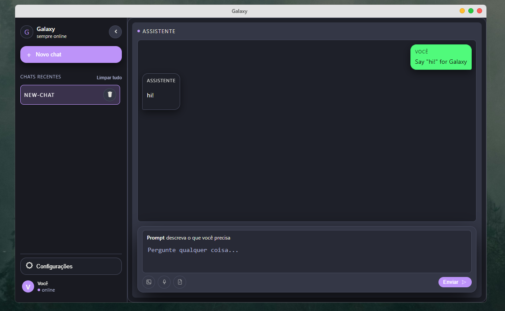
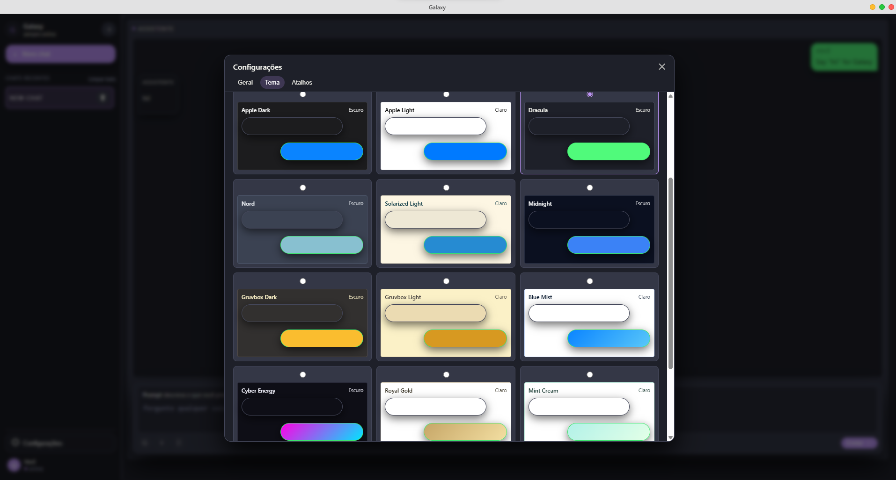

# Galaxy — AI Desktop App (Tauri + Rust)

Galaxy is a lightweight Windows desktop application built with Tauri, Rust, SQLite, and SvelteKit. It integrates ChatGPT, Copilot, and Anthropic into a single, fast, and customizable environment — allowing you to interact with multiple AIs without opening a browser. Designed for performance, low RAM usage, and high customizability, Galaxy runs smoothly even on low-end PCs.

## Features

- Multi-AI Integration ChatGPT, Copilot, and Anthropic — all in one place.
- Image interpretation Send images and get instant analysis or explanations.
- Audio support Upload audio files for transcription or processing.
- Ultra-lightweight Built with Tauri + Rust, using minimal resources.
- Fully customizable themes Offers multiple presets and supports user-created themes.
- Fast responses Optimized for speed and smooth user experience.
- Built for all PCs Works perfectly even on weak or older machines.

## Themes

  

## Why Galaxy?

Galaxy was created to reduce browser usage and avoid the heavy resource consumption of modern web browsers. The goal was to build an app that is:

- extremely lightweight
- fast and stable
- fully customizable
- able to run on low-spec hardware

Originally built for personal use, Galaxy is now a polished, ready-to-use application open to future improvements.

## Project Structure

```
src/
  components/
    chat/
    config/
    osTab/
    sideTab/
  routes/
    +layout.svelte
    +layout.ts
    +page.svelte
    style.css
    app.html

src-tauri/
  capabilities/
  gen/
  icons/
  src/
  build.rs
  Cargo.toml

```

## Technologies Used

- Tauri, lightweight native shell
- Rust, fast and safe backend
- SQLite, efficient local database
- SvelteKit, modern and reactive UI framework

## Installation

### Requirements

- Windows
- Download the .msi or .exe installer<br> [Download Galaxy v1](https://github.com/819SauCe/Galaxy/releases/tag/v1)

### Steps

1. Download the latest release
2. Run the .msi or .exe installer
3. Launch Galaxy
4. Enter your API keys (ChatGPT / Copilot / Anthropic)
5. Start chatting instantly!

## Usage

1. Open the application
2. Select the AI model you want to use
3. Type a question, upload an image, or send an audio file
4. Receive fast and optimized responses
5. Customize the theme at any time

## Contributing

Contributions are welcome!<br> Feel free to open issues, submit pull requests, or suggest new features.

## License

This project is licensed under the MIT License, free to use, modify, and distribute.

## Project Status

Completed, but open to enhancements and new features in the future.
